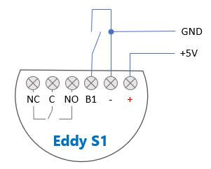

# Eddy S1   
## Smart, powerful and cheap DIY WiFi switch
Eddy S1 is a smart, powerful and cheap WiFi switch based on a [Mongoose OS](https://mongoose-os.com/) firmware. It can be easily integrated with your home automation system using MQTT protocol.
## Functional schema
This is the functional schema of Eddy S1.

## GET STARTED
1. Connect your PC to the Eddy S1 using an USB cable or WiFi
2. Set the button mode (optional)
3. Set the relay inching mode (optional)
4. Set [mDash](https://mdash.net/) connection (optional)
5. Set MQTT connection
6. Connect Eddy S1 to your WiFi
## Connect your PC to the Eddy S1
Connect your PC to the Eddy S1 to start the initial configuration or to update it. You can establish the connection in two ways:
## Set the button mode
The B1 button supports 4 different modes:
|Mode|||
|--|--|--|
|0|DASH_BUTTON|The button runs like a [dash button](https://github.com/diy365-mgos/bbutton) raising [events](https://github.com/diy365-mgos/bbutton/blob/master/README.md#mgos_bbutton_event), but without changing the relay's status.|
|1|DETACHED|The button is detached and it doesn't change the relay's status.|
|2|TOGGLE_ON_PUSH|The button toggle the relay's status every time it is presed(closed) and then released(open).|
|3|TOGGLE_ON_EDGE|The button toggle the relay's status every time it is presed(closed) or released(open). This is the defualt mode.|
